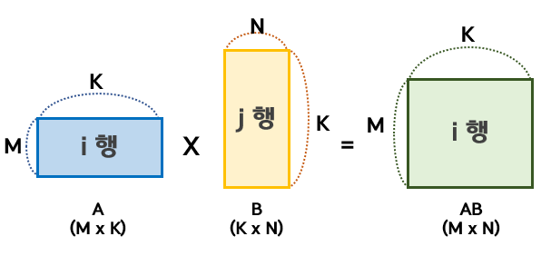
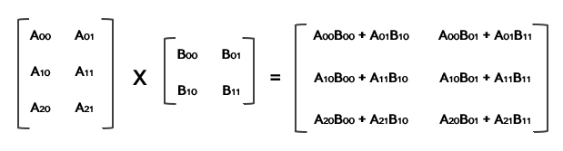

#### 행렬의 곱셈



- 앞 행렬의 열의 개수 = 뒤 행렬의 행의 개수 일때 곱셈 성립

  

- 앞 행렬의 i행과 뒤 행렬의 j열의 성분을 차례로 곱한 값이  (i,j) 성분 

- 행렬의 거듭 제곱은 정 사각행렬에서만 가능


```c++
vector<vector<int>> solution(vector<vector<int>> arr1, vector<vector<int>> arr2) {
    
      int iRow_A = arr1.size(); 
    int iCol_B = arr2[0].size(); 
    int iRow_B= arr2.size();
    
    vector<vector<int>> answer(iRow_A,vector<int>(iCol_B,0));
    

    for(int i=0;i<iRow_A;++i)
    {
        for(int j=0; j<iCol_B;++j)      
        {
            for(int z= 0;z< iRow_B;++z)
            {
                answer[i][j] += arr1[i][z] * arr2[z][j];   
            }
        }
    }
    
    return answer;
}
```

